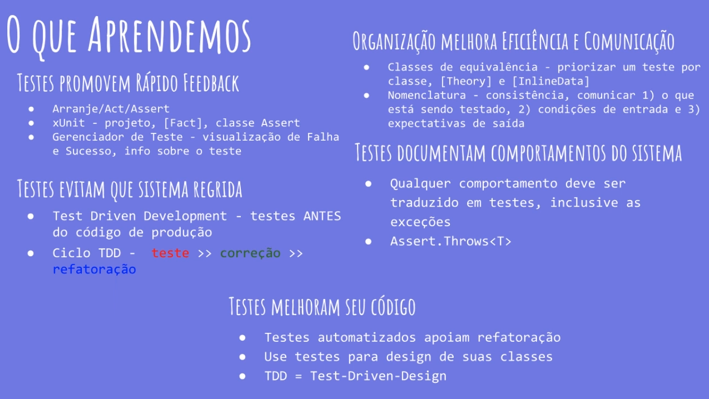

# Alura Testes de unidade e TDD com xUnit
Curso da Alura sobre testes de unidade e TDD com xUnit.

** [C#: Testes de unidade e TDD com xUnit](https://cursos.alura.com.br/course/tdd-csharp-xunit)** 

* :white_check_mark: Promovendo rápido feedback
* :white_check_mark: Organizando seus testes
* :white_check_mark: Não deixe o sistema regredir
* :white_check_mark: Testando todos os comportamentos
* :white_check_mark: Ajudando no design do código

 

 

 

